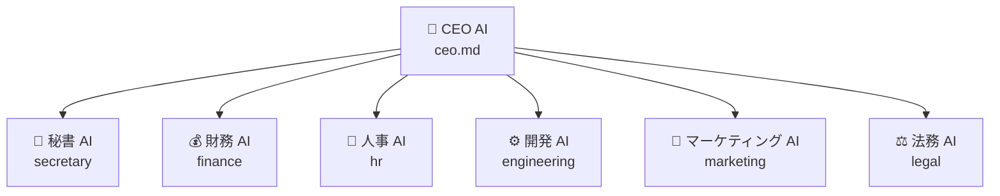
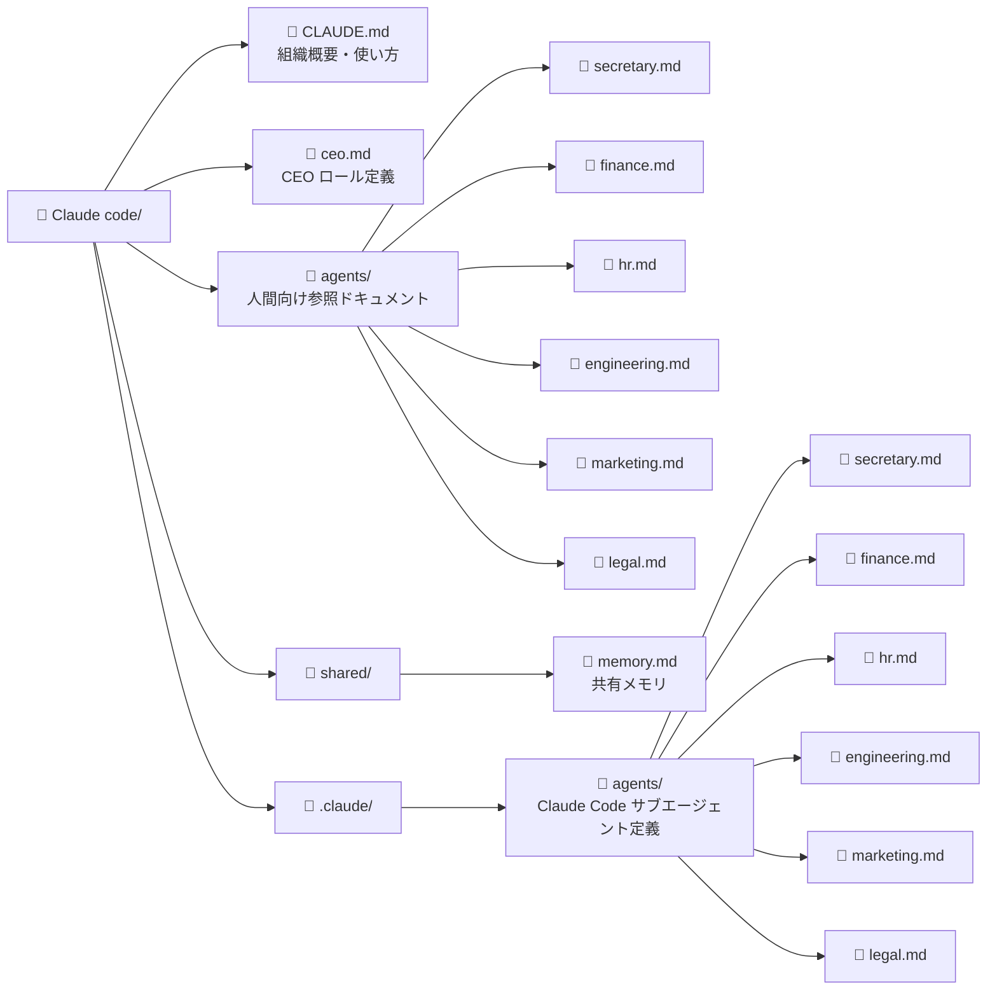
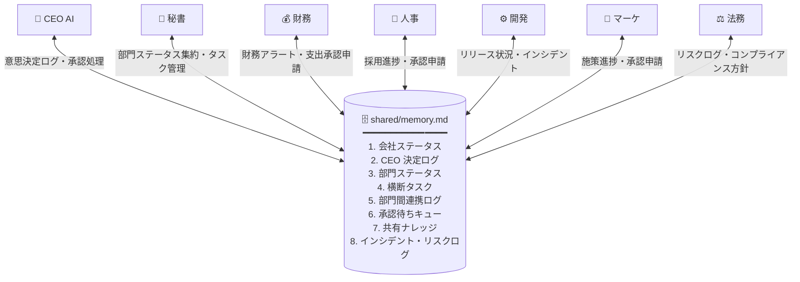
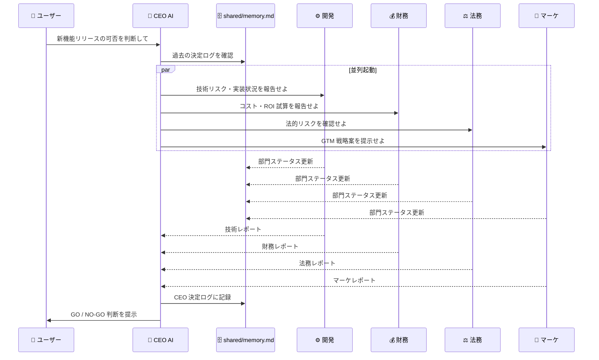
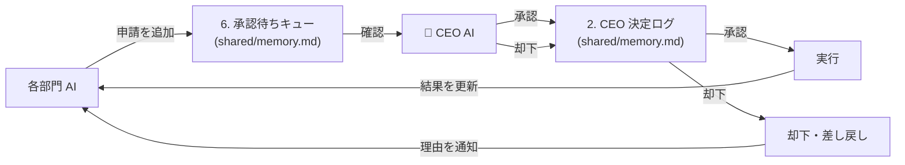

# AI Company — 構造図

## 1. 組織階層

```mermaid
graph TD
    CEO["🏢 CEO AI<br/>ceo.md"]

    SEC["📅 秘書 AI<br/>secretary"]
    FIN["💰 財務 AI<br/>finance"]
    HR["👥 人事 AI<br/>hr"]
    ENG["⚙️ 開発 AI<br/>engineering"]
    MKT["📣 マーケティング AI<br/>marketing"]
    LEG["⚖️ 法務 AI<br/>legal"]

    CEO --> SEC
    CEO --> FIN
    CEO --> HR
    CEO --> ENG
    CEO --> MKT
    CEO --> LEG
```

---

## 2. ファイル構造

```mermaid
graph LR
    ROOT["📁 Claude code/"]

    ROOT --> CLAUDE["📄 CLAUDE.md<br/>組織概要・使い方"]
    ROOT --> CEO_F["📄 ceo.md<br/>CEO ロール定義"]
    ROOT --> AGENTS_D["📁 agents/<br/>人間向け参照ドキュメント"]
    ROOT --> SHARED["📁 shared/"]
    ROOT --> DOTCLAUDE["📁 .claude/"]

    AGENTS_D --> A1["📄 secretary.md"]
    AGENTS_D --> A2["📄 finance.md"]
    AGENTS_D --> A3["📄 hr.md"]
    AGENTS_D --> A4["📄 engineering.md"]
    AGENTS_D --> A5["📄 marketing.md"]
    AGENTS_D --> A6["📄 legal.md"]

    SHARED --> MEM["📄 memory.md<br/>共有メモリ"]

    DOTCLAUDE --> AGENTS_SUB["📁 agents/<br/>Claude Code サブエージェント定義"]
    AGENTS_SUB --> B1["📄 secretary.md"]
    AGENTS_SUB --> B2["📄 finance.md"]
    AGENTS_SUB --> B3["📄 hr.md"]
    AGENTS_SUB --> B4["📄 engineering.md"]
    AGENTS_SUB --> B5["📄 marketing.md"]
    AGENTS_SUB --> B6["📄 legal.md"]
```

---

## 3. 情報フロー（共有メモリを中心に）

```mermaid
graph TD
    MEM[("🗄️ shared/memory.md\n━━━━━━━━━━━━━━━\n1. 会社ステータス\n2. CEO 決定ログ\n3. 部門ステータス\n4. 横断タスク\n5. 部門間連携ログ\n6. 承認待ちキュー\n7. 共有ナレッジ\n8. インシデント・リスクログ")]

    CEO["🏢 CEO AI"]
    SEC["📅 秘書"]
    FIN["💰 財務"]
    HR["👥 人事"]
    ENG["⚙️ 開発"]
    MKT["📣 マーケ"]
    LEG["⚖️ 法務"]

    CEO <-->|"意思決定ログ・承認処理"| MEM
    SEC <-->|"部門ステータス集約・タスク管理"| MEM
    FIN <-->|"財務アラート・支出承認申請"| MEM
    HR  <-->|"採用進捗・承認申請"| MEM
    ENG <-->|"リリース状況・インシデント"| MEM
    MKT <-->|"施策進捗・承認申請"| MEM
    LEG <-->|"リスクログ・コンプライアンス方針"| MEM
```

---

## 4. 並列オーケストレーション（例: 新機能リリース判断）

```mermaid
sequenceDiagram
    participant U as 👤 ユーザー
    participant C as 🏢 CEO AI
    participant M as 🗄️ shared/memory.md
    participant E as ⚙️ 開発
    participant F as 💰 財務
    participant L as ⚖️ 法務
    participant K as 📣 マーケ

    U->>C: 新機能リリースの可否を判断して
    C->>M: 過去の決定ログを確認

    par 並列起動
        C->>E: 技術リスク・実装状況を報告せよ
        C->>F: コスト・ROI 試算を報告せよ
        C->>L: 法的リスクを確認せよ
        C->>K: GTM 戦略案を提示せよ
    end

    E-->>M: 部門ステータス更新
    F-->>M: 部門ステータス更新
    L-->>M: 部門ステータス更新
    K-->>M: 部門ステータス更新

    E-->>C: 技術レポート
    F-->>C: 財務レポート
    L-->>C: 法務レポート
    K-->>C: マーケレポート

    C->>M: CEO 決定ログに記録
    C->>U: GO / NO-GO 判断を提示
```

---

## 5. 承認フロー

```mermaid
flowchart LR
    DEPT["各部門 AI"]
    Q["6. 承認待ちキュー\n(shared/memory.md)"]
    CEO["🏢 CEO AI"]
    LOG["2. CEO 決定ログ\n(shared/memory.md)"]
    EXEC["実行"]
    REJECT["却下・差し戻し"]

    DEPT -->|"申請を追加"| Q
    Q -->|"確認"| CEO
    CEO -->|"承認"| LOG
    CEO -->|"却下"| LOG
    LOG -->|"承認"| EXEC
    LOG -->|"却下"| REJECT
    EXEC -->|"結果を更新"| DEPT
    REJECT -->|"理由を通知"| DEPT
```
